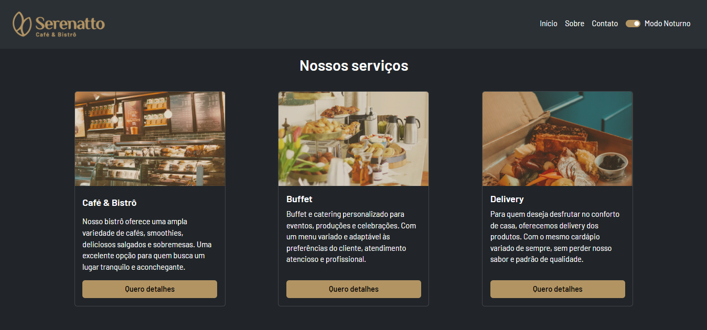
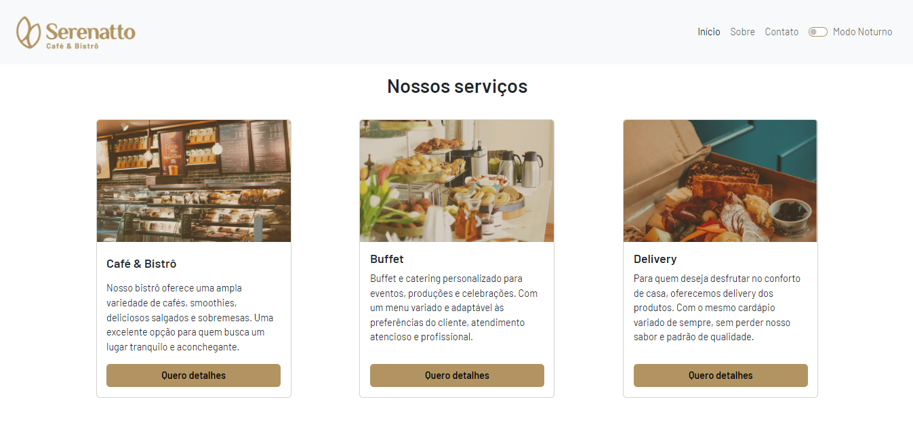
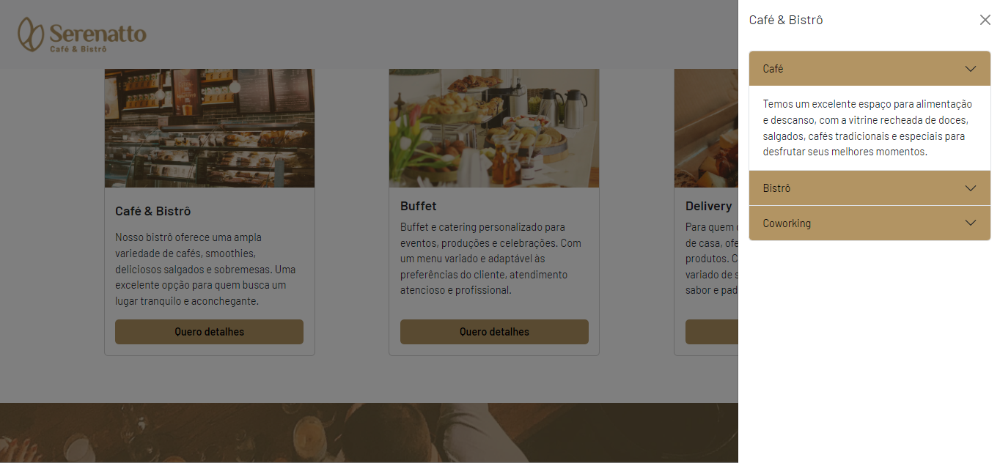
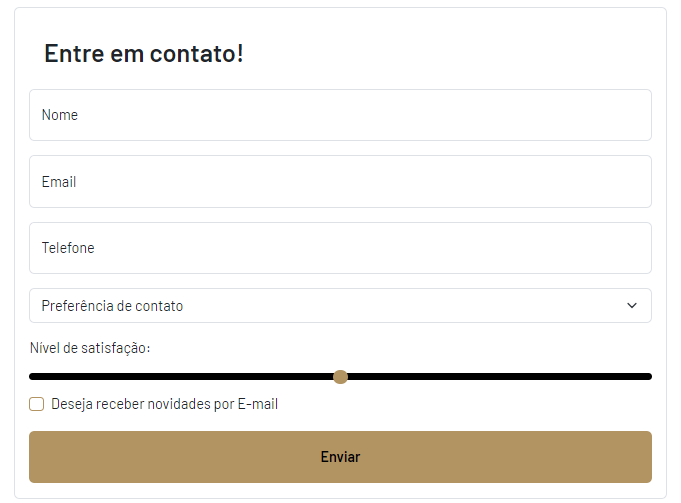

# Serenatto Café & Bistrô


## Descrição

O **Serenatto** é um website desenvolvido para um café e bistrô fictício, oferecendo informações sobre os serviços disponíveis, como café, buffet, delivery e produtos especiais. O site é totalmente responsivo, com integração de componentes do Bootstrap para uma navegação intuitiva e moderna.

## Funcionalidades

- Exibição dos serviços do café e bistrô, com cards interativos.
- Opção de alternar entre Modo Claro e Modo Noturno.
- Formulário de contato funcional para envio de mensagens.
- Seções com informações sobre produtos, serviços e espaços do café.
- Interface moderna e responsiva, projetada com Bootstrap 5.

## Tecnologias Utilizadas

- **HTML5**: Estrutura básica do site.
- **CSS3**: Estilos personalizados.
- **Bootstrap 5**: Framework para layout e componentes responsivos.
- **Google Fonts**: Tipografias personalizadas.
- **Bootstrap Icons**: Ícones para melhorar a UI.

## Funcionalidades Detalhadas

**Modo Noturno**
O site inclui uma funcionalidade de alternância entre modo claro e escuro através de um switch no menu de navegação. Este modo permite aos usuários ajustarem a aparência do site de acordo com sua preferência visual.



**Cards Interativos**
Cada serviço (Café & Bistrô, Buffet, Delivery) é representado por um card que, ao ser clicado, abre um offcanvas com mais detalhes sobre o serviço. Além dos cards de produtos, que, quando clicados, exibem um modal com mais detalhes.

<div style="text-align: center;">

</div>

**Formulário de Contato**
O formulário de contato permite que os usuários enviem seus dados e escolham a forma preferida de contato. Ele inclui validação de campos como nome, e-mail e telefone.

<div style="text-align: center;">

</div>

## Melhorias Futuras

1. **Funcionalidade de autenticação**: incluir sistema de login para os usuários oferecendo assim uma experiência mais personalizada e única.

2. **Integração com APIs de pagamento**: Possibilitando pedidos de Delivery direto pelo site.

3. **Backend** Implementar uma API para gerenciar o banco de dados de pedidos e contatos.

## Como Executar o Projeto

1. Clone o repositório para sua máquina local usando:
   ```bash
   git clone https://github.com/GuiBarbosa13/Serenatto


<div style="width: 100%; height: 100px; background-image: url('./assets/banner-3.png'); background-size: cover;"></div>
